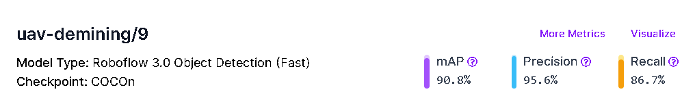
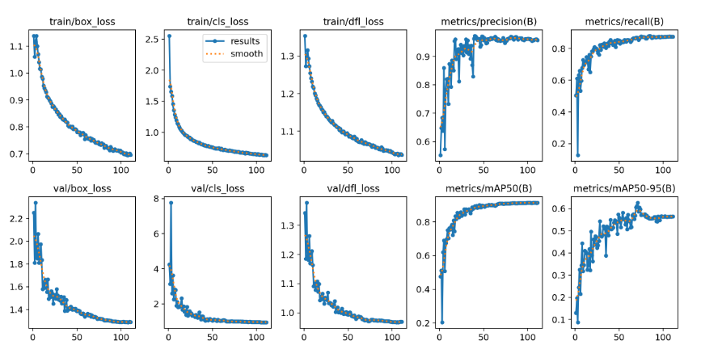

  

      
      
      
      
      
      
      
      
      <a href="https://disuss.roboflow.com">
          
      
      
      </a>
  

# Information

This repository contains the code and white paper for the demining project using YOLO v8. Data labeling, model training and inference are all handled through Roboflow. 
#### Attention: Please read the white paper for an in-depth overview of the project and its planned stages. 

### Current Stage: Stage 1

The web page in this repository supports running a model hosted on Roboflow by:

1. Using your webcam to run inference.
2. Selecting from a predefined image to run inference.
3. Uploading an image to run inference.

## Project Screenshots and Metrics

## Technology Stack

- JavaScript
- [roboflow.js](https://docs.roboflow.com/inference/web-browser)
