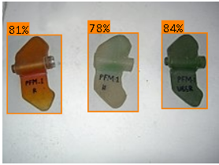

# Information

This repository contains the code and white paper for the demining project using YOLO v8. Data labeling, model training and inference are all handled through Roboflow. 
#### Attention: Please read the white paper for an in-depth overview of the project and its planned stages. 

### Current Stage: Initial Data Collection and YOLO v8 Training

This stage began in October of 2023 and is set to be successfully completed by the beginning of January 2024. Up until now, the initial dataset of landmines has been constructed, with the FPM-1, TM-62 and MON-50 landmines being represented in the dataset at the moment. The algorithm of choice has been trained through Roboflow and is showing encouraging results with the detection of these landmines. On the other hand, the current dataset is currently being cleaned and supplemented by additional images that will need to be labeled and whose quality will need to be verified.

### Next Stage: Sensor Implementation

Equally as crucial as the first stage is the implementation of sensors, which will begin in January of 2024 and end with a drone prototype that has all of the aforementioned sensors. Feedback will be provided at every step of the process by collaborating partners, with the sensors ideally ready for use by the beginning of the summer of 2024. 

## Project Screenshots and Metrics

## Technology Stack

- JavaScript
- [roboflow.js](https://docs.roboflow.com/inference/web-browser)
